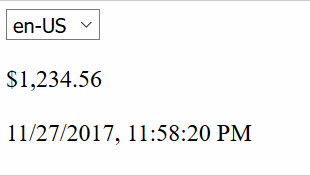

# JavaScript Native i18n API

Using the method toLocaleString() to do native i18n in JavaScript

## Demo

## References

* [Number.prototype.toLocaleString()](https://developer.mozilla.org/en-US/docs/Web/JavaScript/Reference/Global_Objects/Number/toLocaleString)
* [Date.prototype.toLocaleString()](https://developer.mozilla.org/en-US/docs/Web/JavaScript/Reference/Global_Objects/Date/toLocaleString)
